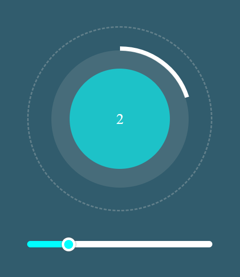
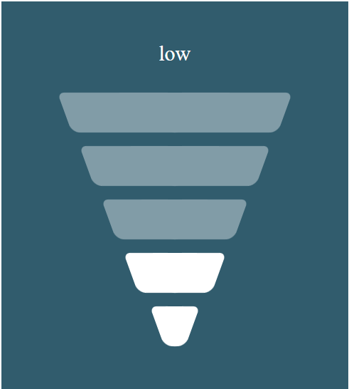

# React Widgets

Customizable Circular Progress Bar and Strength Bar Widgets developed using React

Check storybook Demo [here](https://63dfe6ad174c4b744e816aa6-aeldsdwwxv.chromatic.com/)

## Circular progress bar

### Props

| Name                  | Description                                                                   |
| --------------------- | ----------------------------------------------------------------------------- |
| height                | height of widget.Default: `200px `                                            |
| circularBarColor      | width of widget.Default:white                                                 |
| widgetBackGroundColor | Background color of the widget.Default: `#315c6d `                            |
| sliderBottomColor     | Slider color.Default: `cyan `                                                 |
| sliderTopColor        | Slider track color.Default: `white`                                           |
| sliderMax             | Upper limit of slider.Default: `10 `                                          |
| slideMin              | Lower limit of slider.Default: `0 `                                           |
| sliderStep            | Step size of slider.Default: `1 `                                             |
| onSliderChange        | Callback function called every time slider is change. parameter: slider_value |

## Strength Bar

### Props

| Name                  | Description                                                              |
| --------------------- | ------------------------------------------------------------------------ |
| height                | height of widget.Default: `200px `                                       |
| widgetBackGroundColor | Background color of the widget.Default: `#315c6d`                        |
| focusBarColor         | Active bar color.Default: `white `                                       |
| BarColor              | Inactive bar color.Default: `#819ca7`                                    |
| onBarChange           | Callback function called every time bar is clicked. parameter: bar_value |
